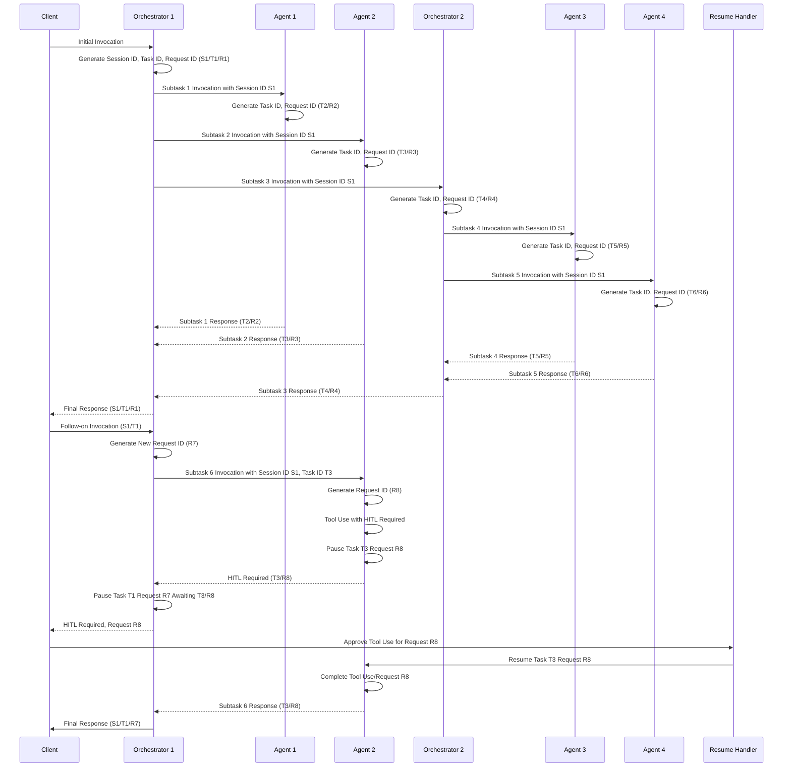

# State Management for Distributed Agentic Systems

This document outlines the state management model for a complex, multi-agent, and multi-orchestrator system. This model is designed to support advanced features like long-running, stateful tasks and Human-in-the-Loop (HITL) interventions.

## Core Concepts

The architecture is built on three fundamental state primitives: **Sessions**, **Tasks**, and **Requests**. This separation provides the necessary granularity to manage complex, asynchronous workflows in a reliable and auditable manner.

### 1. Session ID (S)
- **Purpose**: Represents the highest-level grouping, corresponding to a continuous interaction or "conversation" with a client.
- **Scope**: It logically groups together multiple related tasks initiated by a user. For example, a user's entire interaction with a chatbot for a specific purpose would be one session.
- **Relevance**: While not directly used for the internal mechanics of agent/orchestrator state, it provides the essential client-facing context and allows clients to manage and reference logical units of work.

### 2. Task ID (T)
- **Purpose**: Represents a single, stateful "job" or goal that the system is asked to accomplish. A task can be simple (a single agent invocation) or complex (an orchestration involving multiple agents and sub-orchestrators).
- **State**: This is the lynchpin of the stateful architecture. The state associated with a Task ID must include:
    - **Interaction History**: A "chat history" or log of all invocations and responses related to the task. This is critical for providing context in follow-on invocations.
    - **Execution Trace**: A record of the steps taken, tools used, and intermediate results generated.
    - **Status**: The current state of the task (e.g., `Running`, `Paused`, `Completed`, `Failed`).
- **Lifecycle**: A task is created upon the initial invocation and persists until it is fully completed. Follow-on invocations from the client reference the same Task ID to leverage its history and state.

### 3. Request ID (R)
- **Purpose**: Represents a single, atomic attempt or invocation within a task. It provides the finest level of granularity for tracking and control.
- **Scope**: A unique Request ID is generated for each invocation of an agent or orchestrator. All actions performed within that invocation, including tool calls, belong to that single Request ID.
- **Criticality for HITL**: The Request ID is the key to enabling HITL. It allows the system to pause not just a general task, but the *specific agent invocation* that requires human approval. This prevents ambiguity and allows for precise control. When a `Resume Handler` approves an action, it targets the specific Request ID.
- **Benefits**:
    - **Idempotency**: If a resume signal is received multiple times, the system can check the status of the Request ID and prevent duplicate execution.
    - **Auditing**: Provides a detailed, auditable log of every single action taken by the system.

## Key Interaction Pattern: The "Cascading Pause" for HITL

The diagram illustrates the critical flow for handling Human-in-the-Loop scenarios:

1.  **Initiation**: An agent (A2) determines it needs to use a tool that requires human approval for a specific invocation (`Request R8`).
2.  **Agent Pause**: The agent pauses its current work on `Task T3` and sends a `HITL Required` message back to its caller (Orchestrator 1), specifying the `Task ID` and `Request ID` (`T3/R8`) that are paused.
3.  **Upstream Propagation**: The orchestrator (`O1`), upon receiving this message, pauses the parent task (`T1`) that was waiting on the result. It knows the subtask hasn't failed, but is merely pending external input.
4.  **Client Notification**: The orchestrator propagates the `HITL Required` message up to the original client, providing the specific `Request ID (R8)` that needs approval.
5.  **Resumption**: The client, through a `Resume Handler` or similar interface, sends an approval signal directly to the component that is paused—the agent (`A2`). This signal specifically targets `Request R8`.
6.  **Completion**: The agent receives the signal, resumes `Request R8`, completes its tool use, and sends its final response back up the chain, un-pausing the parent tasks along the way.

## Summary of Benefits

This S/T/R model provides a robust framework for building complex AI systems by delivering:
- **Clear Separation of Concerns**: Each primitive has a distinct and well-defined purpose.
- **Granular Control**: Enables precise actions like pausing and resuming specific requests.
- **Traceability & Auditability**: Creates a clear, hierarchical log of all actions taken.
- **Scalability**: Supports complex, nested workflows with multiple asynchronous actors.
- **Stateful Context**: Allows for rich, multi-turn interactions and follow-on requests.
