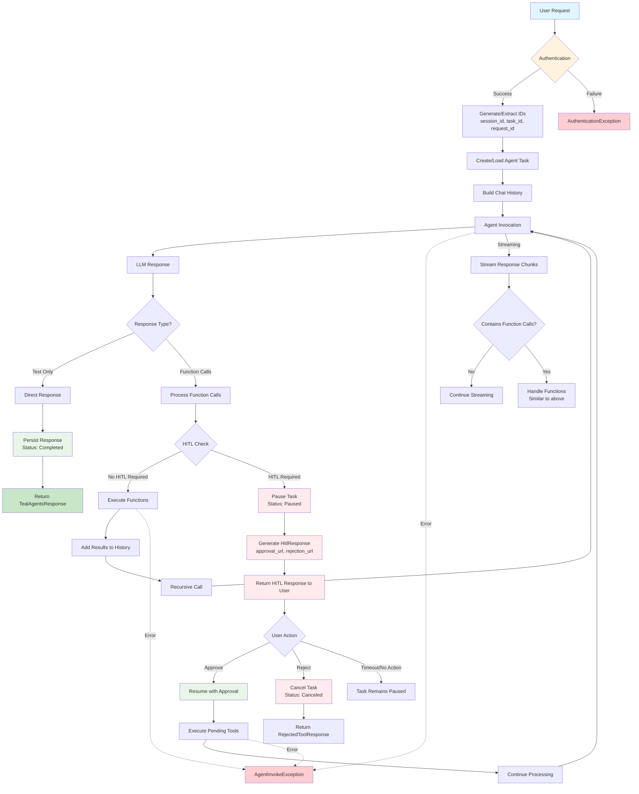
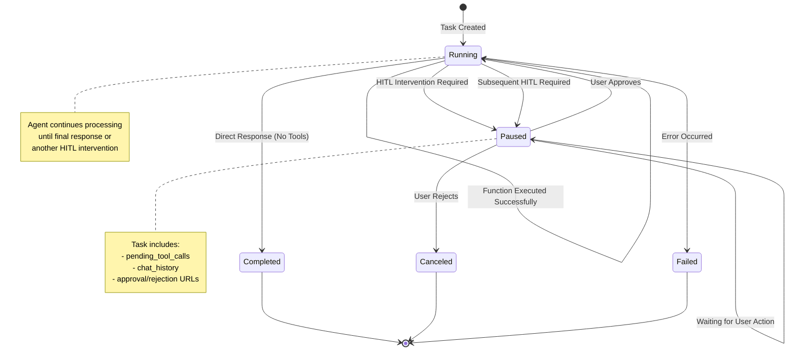

# TealAgents v1alpha1 API Documentation

This directory contains the v1alpha1 implementation of the TealAgents framework, providing a comprehensive agent orchestration system built on top of the Semantic Kernel framework. This implementation focuses on conversational AI agents with support for function calling, human-in-the-loop (HITL) interventions, and advanced state management.

## Overview

The v1alpha1 API provides a structured approach to building and managing AI agents with features including:

- **Agent Configuration**: Flexible agent setup with model selection, system prompts, and plugin management
- **Function Calling**: Automatic and manual tool execution with intervention capabilities
- **State Management**: Persistent conversation history and task tracking
- **Human-in-the-Loop**: Approval workflows for sensitive operations
- **Streaming Support**: Real-time response streaming for improved user experience
- **Multi-modal Support**: Text and image content handling
- **Token Usage Tracking**: Comprehensive metrics for model consumption

## Architecture

The v1alpha1 implementation follows a layered architecture:

```text
┌─────────────────────────────────────────┐
│            Handler Layer                │
│     (TealAgentsV1Alpha1Handler)         │
├─────────────────────────────────────────┤
│           Agent Layer                   │
│        (SKAgent, AgentBuilder)          │
├─────────────────────────────────────────┤
│        Configuration Layer              │
│     (Config, AgentConfig, Spec)         │
├─────────────────────────────────────────┤
│           Utility Layer                 │
│       (Utils, Type Converters)          │
└─────────────────────────────────────────┘
```

## File Structure and Documentation

### Core Module Files

#### `__init__.py`

**Purpose**: Entry point and factory for the v1alpha1 API

**Key Functions:**

- `handle(config: BaseConfig, app_config: AppConfig, authorization: str | None = None)`: Main entry point that routes requests based on API version and kind
- `_handle_teal(config: BaseConfig, app_config: AppConfig, authorization: str | None = None) -> BaseHandler`: Creates and configures the TealAgentsV1Alpha1Handler

**Dependencies:**

- Semantic Kernel components for agent creation
- Remote plugin loading capabilities
- Chat completion and kernel builders

---

#### `agent_builder.py`

**Purpose**: Factory class for creating configured SKAgent instances

**Classes:**

##### `AgentBuilder`

**Purpose**: Builds and configures SKAgent instances with proper kernel setup

**Constructor Parameters:**

- `kernel_builder: KernelBuilder` - Factory for creating Semantic Kernel instances
- `authorization: str | None` - Optional authorization token

**Key Methods:**

- `async build_agent(agent_config: AgentConfig, extra_data_collector: ExtraDataCollector | None = None, output_type: str | None = None) -> SKAgent`
  - Creates a fully configured SKAgent with kernel, settings, and model attributes
  - Handles structured output configuration for supported models
  - Sets up function choice behavior and temperature settings

**Responsibilities:**

- Kernel creation and configuration
- Model capability detection (structured output support)
- Function calling behavior setup
- Temperature and execution settings configuration

---

#### `config.py`

**Purpose**: Data models for agent configuration

**Classes:**

##### `AgentConfig`

**Purpose**: Configuration model for individual agents

**Attributes:**

- `name: str` - Unique identifier for the agent
- `model: str` - Model name/identifier to use
- `system_prompt: str` - Instructions for the agent
- `temperature: float | None` - Creativity/randomness setting (0.0-1.0)
- `plugins: list[str] | None` - List of local plugin names to load
- `remote_plugins: list[str] | None` - List of remote plugin URLs/identifiers

**Features:**

- Pydantic validation with extra field allowance
- Temperature constraints (0.0 ≤ temperature ≤ 1.0)
- Optional plugin configuration

---

#### `sk_agent.py`

**Purpose**: Wrapper class for Semantic Kernel ChatCompletionAgent with enhanced capabilities

**Classes:**

##### `SKAgent`

**Purpose**: Enhanced agent wrapper providing model metadata and streaming capabilities

**Constructor Parameters:**

- `model_name: str` - Name of the underlying model
- `model_attributes: dict[str, Any]` - Model capability metadata
- `agent: ChatCompletionAgent` - Configured Semantic Kernel agent

**Key Methods:**

- `get_model_type() -> ModelType`: Returns the model type (OpenAI, Anthropic, etc.)
- `so_supported() -> bool`: Indicates if the model supports structured output
- `async invoke_stream(history: ChatHistory) -> AsyncIterable[StreamingChatMessageContent]`: Streams responses
- `async invoke(history: ChatHistory) -> AsyncIterable[ChatMessageContent]`: Standard invocation

**Features:**

- Model capability abstraction
- Unified streaming and standard invocation interfaces
- Metadata management for model attributes

---

#### `utils.py`

**Purpose**: Utility functions for content conversion and token usage calculation

**Key Functions:**

##### Content Conversion

- `item_to_content(item: MultiModalItem) -> TextContent | ImageContent`: Converts MultiModalItem to Semantic Kernel content types
- `parse_chat_history(chat_history: ChatHistory, inputs: dict[str, Any] | None = None) -> ChatHistory`: Parses and adds user input to chat history

##### Token Usage Calculation

- `get_token_usage_for_response(model_type: ModelType, content: ChatMessageContent) -> TokenUsage`: Extracts token usage from model responses
- `get_token_usage_for_openai_response(content: ChatMessageContent) -> TokenUsage`: OpenAI-specific token usage extraction
- `get_token_usage_for_anthropic_response(content: ChatMessageContent) -> TokenUsage`: Anthropic-specific token usage extraction

**Features:**

- Multi-modal content support (text, images)
- Model-agnostic token usage tracking
- Chat history management utilities

---

### Agent Subdirectory

#### `agent/__init__.py`

**Purpose**: Package initialization (currently empty)

---

#### `agent/config.py`

**Purpose**: Configuration models for the agent handler system

**Classes:**

##### `Spec`

**Purpose**: Specification container for agent configuration

**Attributes:**

- `agent: AgentConfig` - The agent configuration

##### `v1alpha1Config`

**Purpose**: Complete configuration model extending BaseConfig

**Inherits**: `BaseConfig`

**Attributes:**

- `spec: Spec` - Agent specification

##### `Config`

**Purpose**: Configuration wrapper and accessor

**Constructor Parameters:**

- `config: BaseConfig` - Base configuration to wrap

**Key Methods:**

- `get_agent() -> AgentConfig`: Extracts the agent configuration from the spec

**Features:**

- Configuration validation and type conversion
- Clean accessor pattern for nested configuration

---

#### `agent/handler.py`

**Purpose**: Main request handler implementing the complete agent interaction workflow

**Classes:**

##### `TealAgentsV1Alpha1Handler`

**Purpose**: Complete implementation of the TealAgents v1alpha1 API

**Inherits**: `BaseHandler`

**Constructor Parameters:**

- `config: BaseConfig` - Agent configuration
- `app_config: AppConfig` - Application configuration
- `agent_builder: AgentBuilder` - Factory for creating agents

**Key Methods:**

###### Authentication & Authorization

- `async authenticate_user(token: str) -> str`: Validates user tokens and returns user ID

###### State Management

- `handle_state_id(inputs: UserMessage) -> tuple[str, str, str]`: Generates or extracts session, task, and request IDs
- `async _manage_incoming_task(...)`: Creates or loads agent tasks
- `async _manage_agent_response_task(...)`: Persists agent responses
- `_build_chat_history(agent_task: AgentTask, chat_history: ChatHistory) -> ChatHistory`: Reconstructs conversation history

###### Function Call Management

- `async _invoke_function(kernel: Kernel, fc_content: FunctionCallContent) -> FunctionResultContent`: Executes individual function calls
- `async _manage_function_calls(...)`: Orchestrates function call execution with HITL support
- `async _manage_hitl_exception(...)`: Handles human-in-the-loop intervention requirements

###### Core Invocation Methods

- `async invoke(auth_token: str, inputs: UserMessage) -> TealAgentsResponse | HitlResponse`: Standard synchronous invocation
- `async invoke_stream(auth_token: str, inputs: UserMessage) -> AsyncIterable[...]`: Streaming invocation
- `async recursion_invoke(...)`: Recursive function call handling
- `async recursion_invoke_stream(...)`: Streaming recursive function call handling

###### Resume Operations

- `async resume_task(auth_token: str, request_id: str, action_status: ResumeRequest, stream: bool)`: Resumes paused tasks after HITL approval/rejection

**Features:**

- **Complete Workflow Management**: End-to-end request processing from authentication to response
- **HITL Integration**: Automatic detection and handling of sensitive operations requiring human approval
- **Recursive Function Calling**: Supports complex multi-step tool execution workflows
- **State Persistence**: Maintains conversation state across multiple interactions
- **Streaming Support**: Real-time response streaming with partial content delivery
- **Error Handling**: Comprehensive exception management with detailed logging
- **Token Tracking**: Accurate token usage calculation across all model interactions
- **Multi-modal Support**: Handles text and image content in conversations

**Workflow:**

1. **Authentication**: Validates user credentials
2. **State Setup**: Creates or loads conversation state
3. **History Reconstruction**: Builds complete chat history from stored tasks
4. **Agent Invocation**: Calls the underlying AI model
5. **Function Processing**: Executes any requested tool calls (with HITL checks)
6. **Response Management**: Persists and returns final responses
7. **Resume Handling**: Manages continuation of paused tasks

**Error Scenarios:**

- Authentication failures
- Invalid configuration
- Missing state data
- Function call failures
- HITL intervention requirements
- Model invocation errors

## Usage Patterns

### Basic Agent Invocation

```python
handler = TealAgentsV1Alpha1Handler(config, app_config, agent_builder)
response = await handler.invoke(auth_token, user_message)
```

### Streaming Responses

```python
async for partial_response in handler.invoke_stream(auth_token, user_message):
    # Process streaming content
    pass
```

### Human-in-the-Loop Workflow

```python
# Initial request may return HitlResponse
result = await handler.invoke(auth_token, user_message)
if isinstance(result, HitlResponse):
    # Present approval options to user
    # User approves/rejects via resume endpoint
    final_result = await handler.resume_task(auth_token, request_id, action)
```

## Configuration Example

```python
agent_config = AgentConfig(
    name="assistant",
    model="gpt-4",
    system_prompt="You are a helpful assistant.",
    temperature=0.7,
    plugins=["web_search", "calculator"],
    remote_plugins=["https://api.example.com/plugin"]
)

config = v1alpha1Config(
    apiVersion="tealagents/v1alpha1",
    kind="agent",
    spec=Spec(agent=agent_config)
)
```

## Key Dependencies

- **Semantic Kernel**: Core AI orchestration framework
- **Pydantic**: Configuration validation and serialization
- **SKA Utils**: Shared utilities for the TealAgents ecosystem
- **Persistence Layer**: State management for conversation history
- **Authorization**: User authentication and authorization services

## Integration Points

- **Plugin System**: Supports both local and remote plugin loading
- **HITL Manager**: Integrates with human-in-the-loop approval workflows
- **Persistence Factory**: Pluggable state storage backends
- **Authorization System**: Extensible user authentication
- **Telemetry**: Comprehensive logging and monitoring integration

## Agent Flow and HITL State Diagram

The following diagram illustrates the complete flow of agent interactions, including Human-in-the-Loop (HITL) intervention states:



### HITL State Transitions



### Key Flow Components

#### 1. Authentication & State Setup

- **User Authentication**: Validates auth token and extracts user ID
- **ID Management**: Generates or extracts session, task, and request IDs
- **State Persistence**: Creates new or loads existing agent tasks

#### 2. Agent Processing Loop

- **Chat History Reconstruction**: Builds complete conversation context
- **LLM Invocation**: Calls the configured AI model
- **Response Analysis**: Determines if response contains function calls

#### 3. Function Call Processing

- **HITL Detection**: Checks if function calls require human approval
- **Automatic Execution**: Runs non-sensitive functions immediately
- **Intervention Handling**: Pauses task and requests user approval for sensitive operations

#### 4. HITL Workflow States

| State | Description | Possible Transitions |
|-------|-------------|---------------------|
| **Running** | Task is actively being processed | → Paused, Completed, Failed |
| **Paused** | Waiting for human approval/rejection | → Running (approve), Canceled (reject) |
| **Completed** | Task finished successfully | → End |
| **Canceled** | Task terminated by user rejection | → End |
| **Failed** | Task failed due to error | → End |

#### 5. Resume Operations

- **Approval Path**: Executes pending tools and continues processing
- **Rejection Path**: Terminates task and returns rejection response
- **State Validation**: Ensures task is in correct state for resumption

#### 6. Response Types

| Response Type | When Returned | Next Steps |
|---------------|---------------|------------|
| **TealAgentsResponse** | Normal completion | End of interaction |
| **HitlResponse** | HITL intervention required | User must approve/reject |
| **RejectedToolResponse** | User rejected tools | Task terminated |
| **TealAgentsPartialResponse** | Streaming mode | Continue streaming |

### Error Handling

The system handles various error scenarios:

- **Authentication Failures**: Invalid or missing auth tokens
- **Configuration Errors**: Malformed agent configurations
- **Model Errors**: LLM service failures or timeouts
- **Function Execution Errors**: Tool call failures
- **State Persistence Errors**: Database/storage failures

Each error type is properly logged and returns appropriate exception responses to maintain system stability and provide clear feedback to users.

This v1alpha1 implementation provides a robust foundation for building sophisticated AI agent applications with enterprise-grade features including state management, security, and human oversight capabilities.
